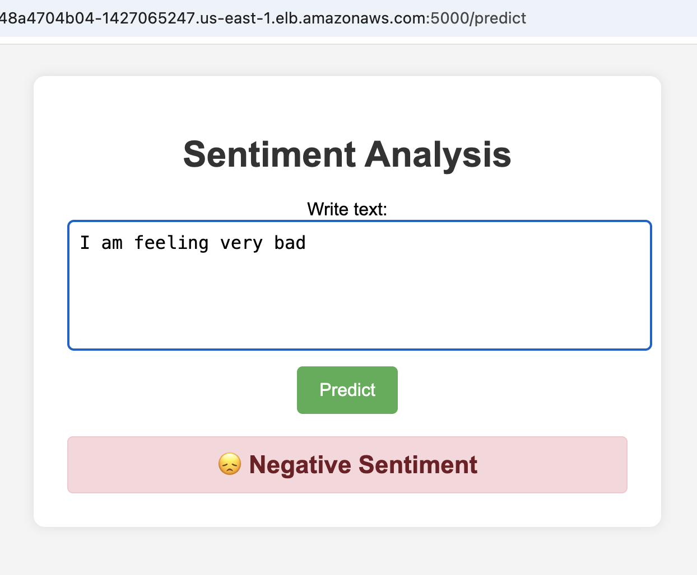
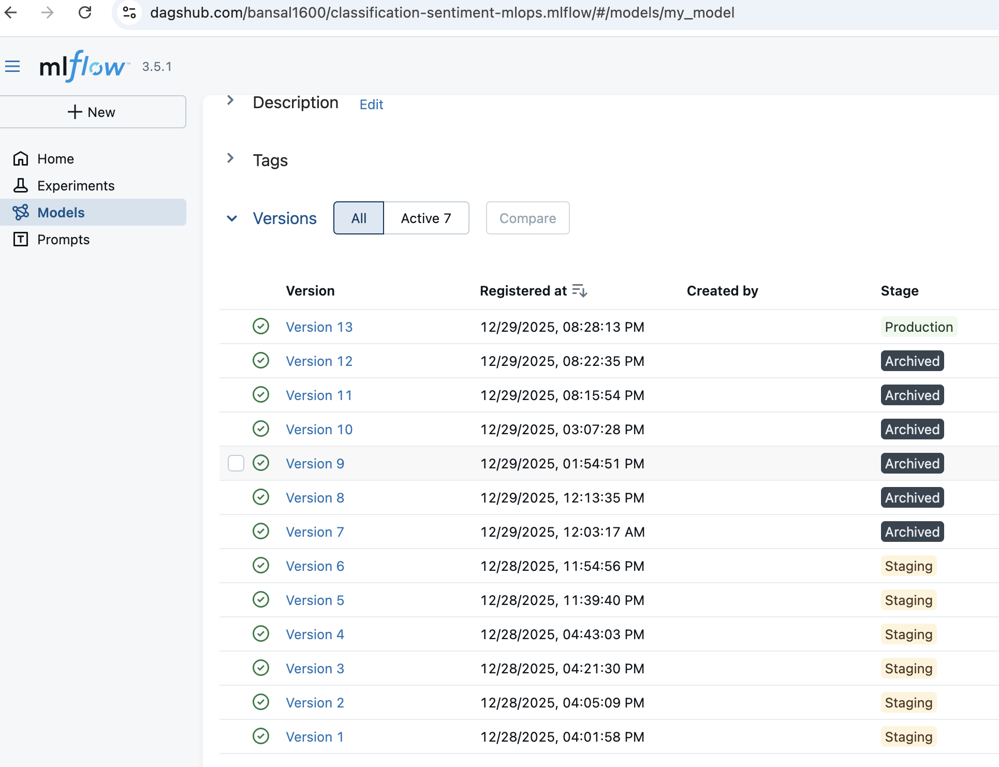
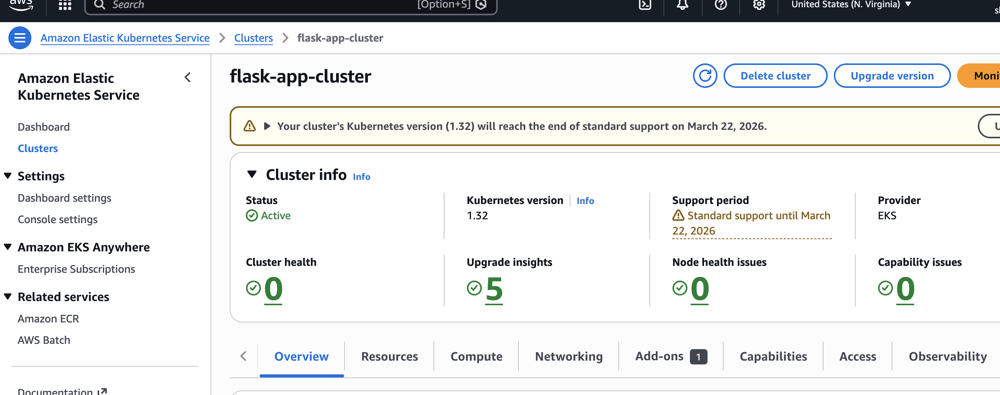
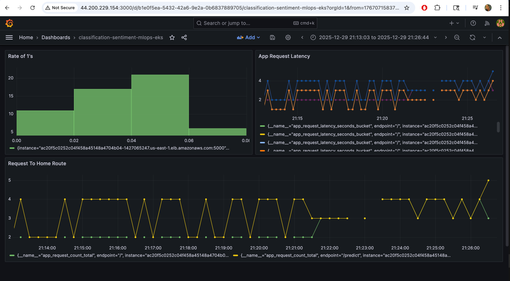
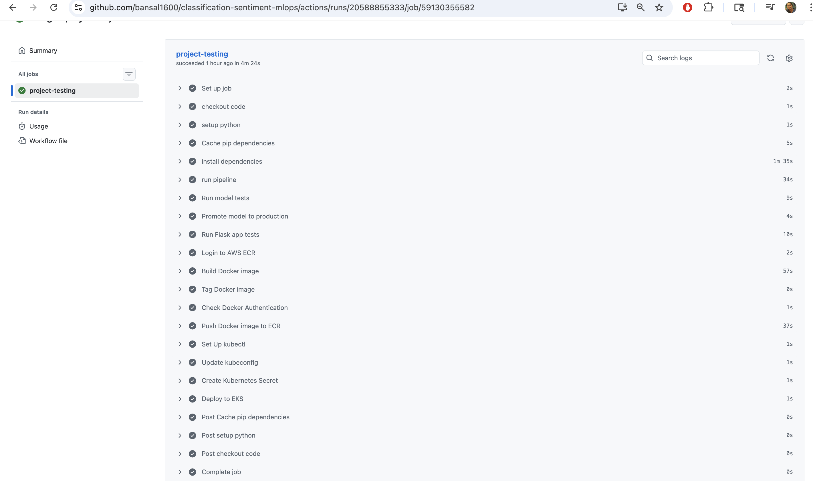

# Sentiment Classification MLOps Project

A complete end-to-end MLOps pipeline for sentiment classification using machine learning, containerization, and Kubernetes orchestration on AWS.

## 📋 Table of Contents

- [Overview](#overview)
- [Tech Stack](#tech-stack)
- [Architecture](#architecture)
- [Features](#features)
- [Project Setup](#project-setup)
- [Deployment](#deployment)
- [Monitoring](#monitoring)
- [Screenshots](#screenshots)
- [Cleanup](#cleanup)
- [Additional Notes](#additional-notes)

## 🎯 Overview

This project implements a production-ready MLOps pipeline for sentiment analysis, including:
- Data versioning with DVC
- Experiment tracking with MLflow on DagsHub
- Model training and evaluation
- Containerized Flask application
- CI/CD pipeline with GitHub Actions
- Kubernetes deployment on AWS EKS
- Monitoring with Prometheus and Grafana

## 🛠️ Tech Stack

### Machine Learning & Data
- **Python 3.11**
- **Scikit-learn** - Machine learning models
- **NLTK** - Natural language processing
- **Pandas & NumPy** - Data manipulation

### MLOps Tools
- **DVC (Data Version Control)** - Data versioning and pipeline management
- **MLflow** - Experiment tracking and model registry
- **DagsHub** - MLflow UI and collaboration platform

### Cloud & Infrastructure
- **AWS Services:**
  - **S3** - Data storage
  - **ECR (Elastic Container Registry)** - Docker image storage
  - **EKS (Elastic Kubernetes Service)** - Container orchestration
  - **EC2** - Monitoring servers (Prometheus & Grafana)
  - **IAM** - Access management
- **Docker** - Containerization
- **Kubernetes (kubectl, eksctl)** - Orchestration

### CI/CD & DevOps
- **GitHub Actions** - Continuous Integration/Deployment
- **Docker** - Containerization
- **Kubernetes** - Container orchestration

### Web Framework
- **Flask** - Web application framework
- **Gunicorn** - WSGI HTTP Server

### Monitoring
- **Prometheus** - Metrics collection
- **Grafana** - Visualization and dashboards

### Development Tools
- **Cookiecutter** - Project template
- **Git** - Version control

## 🏗️ Architecture

### Architecture Components:
1. **Data Pipeline (DVC)**: Version-controlled data processing pipeline
2. **Model Training**: Automated model training with experiment tracking
3. **Container Registry (ECR)**: Docker image storage
4. **Kubernetes Cluster (EKS)**: Container orchestration
5. **Load Balancer**: External access to the application
6. **Monitoring Stack**: Prometheus + Grafana for observability

## ✨ Features

- ✅ Automated data pipeline with DVC
- ✅ Experiment tracking with MLflow
- ✅ Model versioning and registry
- ✅ Containerized Flask application
- ✅ CI/CD pipeline with automated testing
- ✅ Kubernetes deployment on AWS EKS
- ✅ Monitoring and observability
- ✅ Scalable and production-ready infrastructure

## 🚀 Project Setup

### Prerequisites
- Python 3.10+
- Conda
- AWS Account with appropriate permissions
- Docker
- kubectl and eksctl installed

### Initial Setup

1. **Clone the repository**
   ```bash
   git clone <repository-url>
   cd classification-sentiment-mlops
   ```

2. **Create and activate virtual environment**
   ```bash
   conda create -n atlas python=3.11
   conda activate atlas
   ```

3. **Install dependencies**
   ```bash
   pip install -r requirements.txt
   ```

4. **Setup project structure**
   ```bash
   pip install cookiecutter
   cookiecutter -c v1 https://github.com/drivendata/cookiecutter-data-science
   # Rename src.models -> src.model
   ```

### MLflow Setup on DagsHub

1. Go to [DagsHub Dashboard](https://dagshub.com/dashboard)
2. Create a new repository and connect it to your GitHub repo
3. Copy the experiment tracking URL and configure MLflow
4. Install DagsHub and MLflow:
   ```bash
   pip install dagshub mlflow
   ```

### DVC Setup

1. **Initialize DVC**
   ```bash
   dvc init
   ```

2. **Configure remote storage (S3)**
   ```bash
   # Create IAM user and S3 bucket first
   aws configure
   dvc remote add -d myremote s3://<bucket-name>
   ```

3. **Run the pipeline**
   ```bash
   dvc repro
   dvc push  # Push data to S3
   ```

### Flask Application

1. **Install Flask**
   ```bash
   pip install flask
   ```

2. **Run the application locally**
   ```bash
   cd flask_app
   python app.py
   ```

## 🐳 Docker Setup

1. **Build Docker image**
   ```bash
   docker build -t capstone-app:latest .
   ```

2. **Run container locally**
   ```bash
   docker run -p 8888:5000 -e CAPSTONE_TEST=<your-token> capstone-app:latest
   ```

3. **Push to ECR** (via CI/CD pipeline)

## ☸️ Kubernetes Deployment

### Prerequisites Installation

**For macOS:**
```bash
brew install kubectl eksctl awscli
```

**Verify installations:**
```bash
aws --version
kubectl version --client
eksctl version
```

### EKS Cluster Setup

1. **Create EKS cluster**
   ```bash
   eksctl create cluster \
     --name flask-app-cluster \
     --region us-east-1 \
     --nodegroup-name flask-app-nodes \
     --node-type t3.small \
     --nodes 1 \
     --nodes-min 1 \
     --nodes-max 1 \
     --managed
   ```

2. **Update kubectl config**
   ```bash
   aws eks update-kubeconfig --region us-east-1 --name flask-app-cluster
   ```

3. **Verify cluster**
   ```bash
   kubectl get nodes
   kubectl get namespaces
   ```

### Deploy Application

The application is automatically deployed via CI/CD pipeline. Manual deployment:

```bash
# Create Kubernetes secret
kubectl create secret generic capstone-secret \
  --from-literal=CAPSTONE_TEST=<your-token>

# Apply deployment
kubectl apply -f deployment.yaml
```

### Verify Deployment

```bash
# Check pods
kubectl get pods

# Check services
kubectl get svc

# Get external IP
kubectl get svc flask-app-service
```

### Access Application

```bash
# Get the LoadBalancer external IP
EXTERNAL_IP=$(kubectl get svc flask-app-service -o jsonpath='{.status.loadBalancer.ingress[0].hostname}')

# Test the application
curl http://${EXTERNAL_IP}:5000
```

## 📊 Monitoring

### Prometheus Setup

1. **Launch EC2 instance** (t3.medium, Ubuntu)
2. **Install Prometheus**
   ```bash
   wget https://github.com/prometheus/prometheus/releases/download/v2.46.0/prometheus-2.46.0.linux-amd64.tar.gz
   tar -xvzf prometheus-2.46.0.linux-amd64.tar.gz
   sudo mv prometheus-2.46.0.linux-amd64 /etc/prometheus
   sudo mv /etc/prometheus/prometheus /usr/local/bin/
   ```

3. **Configure Prometheus**
   ```yaml
   # /etc/prometheus/prometheus.yml
   global:
     scrape_interval: 15s
   
   scrape_configs:
     - job_name: "flask-app"
       static_configs:
         - targets: ["<your-loadbalancer-url>:5000"]
   ```

4. **Run Prometheus**
   ```bash
   /usr/local/bin/prometheus --config.file=/etc/prometheus/prometheus.yml
   ```

5. **Access Prometheus UI**: `http://<ec2-public-ip>:9090`

### Grafana Setup

1. **Launch EC2 instance** (t3.medium, Ubuntu)
2. **Install Grafana**
   ```bash
   wget https://dl.grafana.com/oss/release/grafana_10.1.5_amd64.deb
   sudo apt install ./grafana_10.1.5_amd64.deb -y
   sudo systemctl start grafana-server
   sudo systemctl enable grafana-server
   ```

3. **Access Grafana UI**: `http://<ec2-public-ip>:3000`
   - Default credentials: `admin/admin`

4. **Add Prometheus as Data Source**
   - Go to Configuration > Data Sources
   - Add Prometheus: `http://<prometheus-ec2-ip>:9090`
   - Save and Test

## 📸 Screenshots

### Application UI


### MLflow Dashboard


### Kubernetes Dashboard


### Grafana Dashboard


### CI/CD Pipeline


## 🧹 Cleanup

### Delete Kubernetes Resources

```bash
# Delete deployment
kubectl delete deployment flask-app

# Delete service
kubectl delete service flask-app-service

# Delete secret
kubectl delete secret capstone-secret
```

### Delete EKS Cluster

```bash
eksctl delete cluster --name flask-app-cluster --region us-east-1

# Verify deletion
eksctl get cluster --region us-east-1
```

### Cleanup AWS Resources

- Delete ECR repositories
- Delete S3 buckets
- Terminate EC2 instances (Prometheus & Grafana)
- Verify CloudFormation stacks are deleted

## 📝 Additional Notes

### CloudFormation and EKS

When you create an EKS cluster using `eksctl`, it automatically creates CloudFormation stacks:
- `eksctl-flask-app-cluster-cluster`: EKS control plane
- `eksctl-flask-app-cluster-nodegroup-flask-app-nodes`: Worker nodes

### Fleet Requests

AWS limits the number of Fleet Requests per account. If you encounter "You've reached your quota for maximum Fleet Requests", you may need to:
- Delete unused Auto Scaling Groups
- Terminate other EKS clusters
- Request a quota increase from AWS

### Persistent Volume Claims (PVC)

PVCs are used to request storage in Kubernetes. They bind to PersistentVolumes (PVs) and use StorageClasses to define provisioning (e.g., EBS volumes on AWS).

### CI/CD Pipeline

The GitHub Actions workflow (`/.github/workflows/ci.yaml`) automates:
1. Running tests
2. Building Docker images
3. Pushing to ECR
4. Deploying to EKS

### Required GitHub Secrets

- `AWS_ACCESS_KEY_ID`
- `AWS_SECRET_ACCESS_KEY`
- `AWS_REGION`
- `AWS_ACCOUNT_ID`
- `ECR_REPOSITORY`
- `CLASSIFICATION_SENTIMENT_MLOPS_GIT_SECRET` (DagsHub token)

## 🔗 Useful Links

- [DagsHub](https://dagshub.com)
- [MLflow Documentation](https://mlflow.org/docs/latest/index.html)
- [DVC Documentation](https://dvc.org/doc)
- [AWS EKS Documentation](https://docs.aws.amazon.com/eks/)
- [Kubernetes Documentation](https://kubernetes.io/docs/)

## 📄 License

MIT

## 👤 Author

Gaurav Bansal

---

**Note**: This project demonstrates a complete MLOps pipeline from data versioning to production deployment with monitoring. Make sure to configure all AWS credentials and secrets before deployment.
